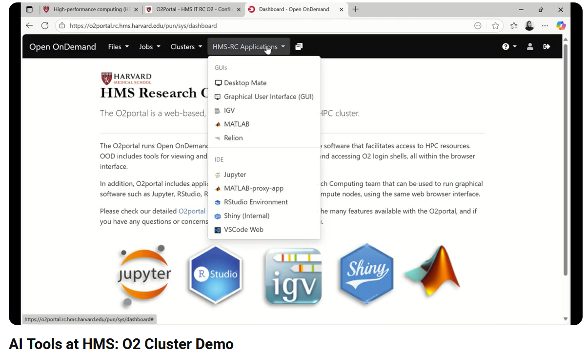

[Play Demo](https://www.youtube.com/watch?v=2JLwxzw0R8s&feature=youtu.be)

---
## 🎥 Demo Video Explanation

This demo video showcases how the [**Longwood Cluster**](https://it.hms.harvard.edu/service/longwood-hpc-cluster) can be used for batch inference with large language models.
For demonstration purposes, it uses a subset of the [MedMCQA](https://huggingface.co/datasets/openlifescienceai/medmcqa) dataset.

This demo runs a Python script for batch inference from the command line on the Longwood Cluster.

The video walks through how to:

- Load the [Qwen/Qwen3-235B-A22B-Instruct-2507](https://huggingface.co/Qwen/Qwen3-235B-A22B-Instruct-2507) model from Hugging Face Hub

- Construct prompts and messages

- Tokenize input prompts

- Generate model inferences

- Process a dataset in batches to obtain LLM responses

- Parse and detokenize the model outputs

The notebook used in this demo is located at:

```LLMTools-HMS/notebooks/Lonwood Cluster/lonwood-demo.ipynb```

*Requirements*
- Acces to the Longwood Cluster. To request access, contact HMS IT Research Computing at rchelp@hms.harvard.edu
  
--- 
## Longwood Cluster Setup (Command Line) To run Python Script
To run longwood-demo.py script, follow these steps to set up an environment on the Longwood Cluster.

````
1. Connect to the Longwood login node
ssh username@login.dgx.rc.hms.harvard.edu

2. Start a GPU interactive session
srun --pty --account=ccb_contrib -t 0-08:00 --mem=256G -c 1 --gres=gpu:4 -p gpu_ccb /bin/bash

3. create a Python virtual environment
python -m venv demo-env

4. Activate the virtual environment
source demo-env/bin/activate

5. Create and enter the project directory
mkdir longwoodDemo
cd longwoodDemo

6. Copy requirements file to the cluster
##clone this repo
module load git
git clone

##OR
##Download the files and use either rsync or scp:
rsync -avz requirements.txt username@login.dgx.rc.hms.harvard.edu:/home/username/longwoodDemo
scp requirements.txt username3@login.dgx.rc.hms.harvard.edu:/home/username/longwoodDemo
