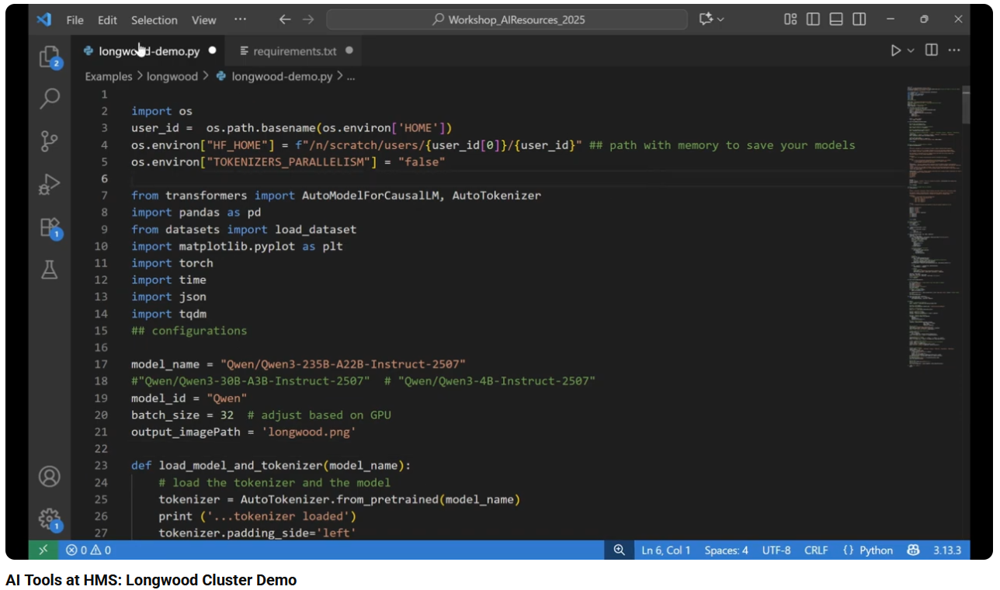

[Play Demo](https://www.youtube.com/watch?v=iQmn4BdOWsw)

---
## 🎥 Demo Video Explanation

This demo video showcases how the [**Longwood Cluster**](https://it.hms.harvard.edu/service/longwood-hpc-cluster) can be used for batch inference with large language models.
For demonstration purposes, it uses a subset of the [MedMCQA](https://huggingface.co/datasets/openlifescienceai/medmcqa) dataset.

This demo runs a Python script for batch inference from the command line on the Longwood Cluster.

The video walks through how to:

- Load the [Qwen/Qwen3-235B-A22B-Instruct-2507](https://huggingface.co/Qwen/Qwen3-235B-A22B-Instruct-2507) model from Hugging Face Hub

- Construct prompts and messages

- Tokenize input prompts

- Generate model inferences

- Process a dataset in batches to obtain LLM responses

- Parse and detokenize the model outputs

The notebook used in this demo is located at:

```LLMTools-HMS/notebooks/Lonwood Cluster/lonwood-demo.py```

*Requirements*
- Acces to the Longwood Cluster. To request access, contact HMS IT Research Computing at rchelp@hms.harvard.edu
  
--- 
## Longwood Cluster Setup (Command Line) To run Python Script
To run longwood-demo.py script, follow these steps to set up an environment on the Longwood Cluster.

Step 1. Connect to the Longwood login node from command line

```ssh username@login.dgx.rc.hms.harvard.edu```

Step 2. Start a GPU interactive session

```srun --pty --account=ccb_contrib -t 0-08:00 --mem=256G -c 1 --gres=gpu:4 -p gpu_ccb /bin/bash```

Step 3. Create a Python virtual environment

```python -m venv demo-env```

Step 4. Activate the virtual environment
   
```source demo-env/bin/activate```

Step 5. Get project files and install dependencies

- Option A: Clone the repository

```module load git
git clone <REPO_URL>
cd LLMTools-HMS/notebooks/Longwood\ Cluster/
pip install -r requirements.txt
```

- Option B: Create a project directory and copy files manually

Create a project directory on the Longwood Cluster:

```mkdir longwoodDemo ```

From a new terminal on your local machine, copy the required files into the Longwood Cluster:
```scp requirements.txt username@login.dgx.rc.hms.harvard.edu:/home/username/longwoodDemo
scp longwood-demo.py username@login.dgx.rc.hms.harvard.edu:/home/username/longwoodDemo
```

Install dependencies from the Longwood login node:
```cd longwoodDemo
pip install -r requirements.txt
