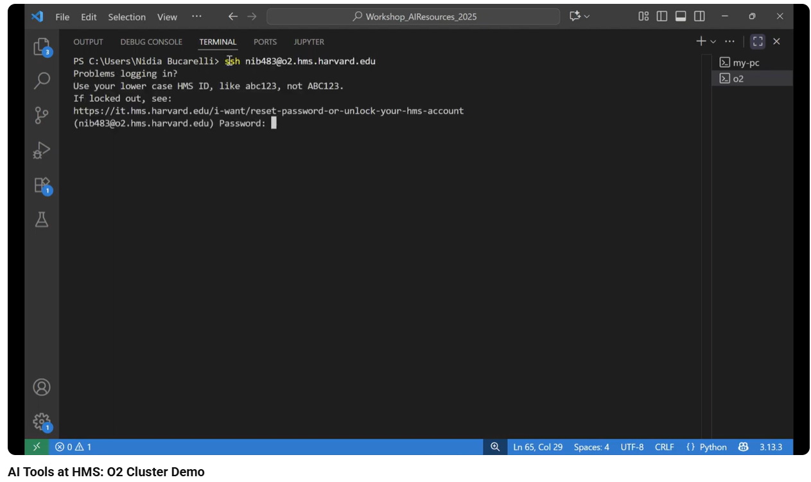

[Play Demo](https://www.youtube.com/watch?v=2JLwxzw0R8s&feature=youtu.be)

---
## 🎥 Demo Video Explanation

This demo video showcases how the [**O2 Cluster**](https://harvardmed.atlassian.net/wiki/spaces/O2/overview) can be used for batch inference with large language models.
For demonstration purposes, it uses a subset of the [MedMCQA](https://huggingface.co/datasets/openlifescienceai/medmcqa) dataset.

The demo leverages Ollama in conjunction with the O2 Portal.

The video walks through how to:

- Launch a Jupyter notebook on the [O2 Portal](https://o2portal.rc.hms.harvard.edu/pun/sys/dashboard) using Ollama

- Load the gemma3:12b model via Ollama

- Construct prompts and messages

- Tokenize input prompts

- Generate model inferences

- Process a dataset in batches to obtain LLM responses

- Parse and detokenize the model outputs

The notebook used in this demo is located at:

```LLMTools-HMS/notebooks/O2/O2-demo.ipynb```

*Requirements*
- Acces to the O2 Cluster. To request access, submit the [O2 Cluster Account Request Form](https://harvardmed.service-now.com/stat?id=sc_cat_item&sys_id=5165e1dbdb209050b642f27139961979&sysparm_category=991a7f2edb890c10b642f2713996196a) 
